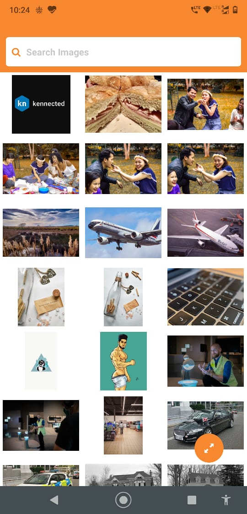
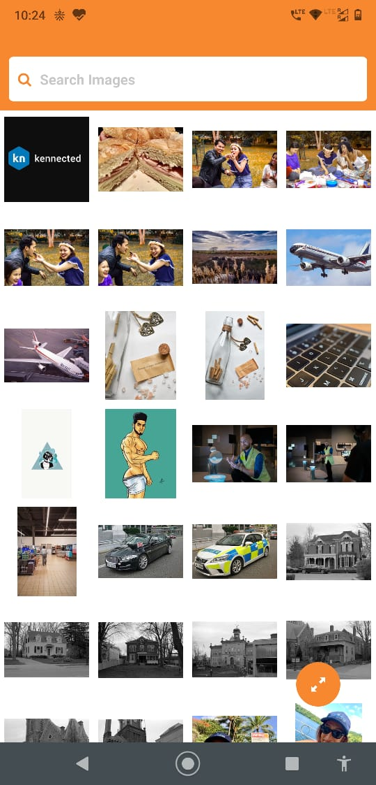

# About
> Basic gallery App build in react-native using expo
## Feature's
- Search Bar with debouncing so api will get call after user stop searching for 300ms
- Infinite scroll 
- Pull to Refresh
- Store data in AsyncStorage 
- Options to change the grid to 2,3,4 Columns

### ISSUE
> When using offline mode you have to ScrollDown To See the saved images 

## Prerequisite
- Node 
- expo cli

## Step to run the project
- clone the repo
- $ npm install
- $ expo start 

## demo image

